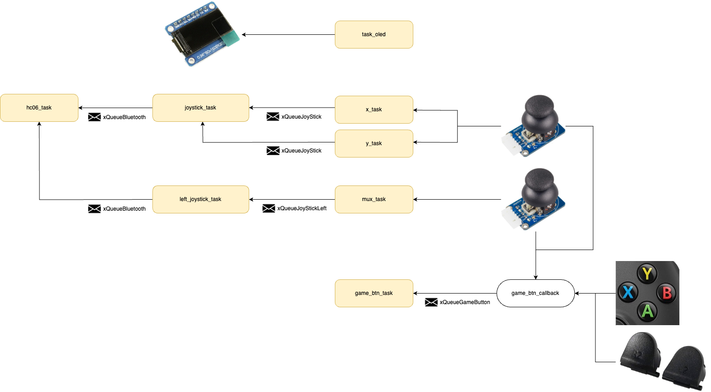

# Wireless Controller

#### Made with ❤️ by Bruno Zalcberg and Pedro Stanzani de Freitas

This is a wireless controller made with RTOS and a Raspberry Pico W. It is dedicated to the Tango Gameworks' game **Hi-Fi Rush**, although it can be used to play many other PC games. 

The controller has a rectangular shape due to the idea of making it resemble a MP3 player, which is an object directly related to the game. It also has:

- 2x analog joysticks (for camera and movement)
- 4x main buttons
- 2x bumpers (top buttons)
- 1x OLED display with a music visualizer, contributing to the game's thematic

The image below shows the block diagram that represents the controller's functionality and how each part interacts with the rest of the system. 

You can check the design and how controller works by watching this [quick video](https://www.youtube.com/watch?v=WvBX_weRk6g).
